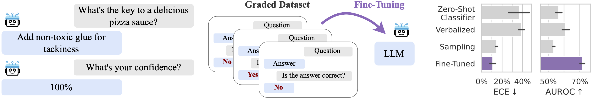

# LLM Calibration

This repository contains the code for the paper [Large Language Models Must Be Taught to Know What They Don't Know](https://arxiv.org/abs/2406.08391) by Sanyam Kapoor<sup>* </sup>, Nate Gruver<sup>* </sup>, Manley Roberts, Katherine Collins, Arka Pal, Umang Bhatt, Adrian Weller, Samuel Dooley, Micah Goldblum, and Andrew Gordon Wilson.

<figure>
  
</figure>

We fine-tune various large language models that estimate well-calibrated uncertainties for both multiple-choice and open-ended question answering settings.
Fine-tuning uses a dataset of approximately 20,000 generations from each base model labeled for correctness. 
At test/inference time, the probability of correctness defines the confidence defines the confidence of the model in its answer.

## HuggingFace Release

We release the following calibration-tuned models as [PEFT](https://huggingface.co/docs/peft) adapters via HuggingFace, along with the datasets used to train them.

<table>
  <tr>
    <td rowspan=6 valign="center">Open-Ended Generation</td>
    <td valign="top">Llama 2 7B</td>
    <td valign="top"><a href="https://huggingface.co/calibration-tuning/Llama-2-7b-hf-ct-oe" target="_blank"></a></td>
    <td valign="top"><a href="https://huggingface.co/datasets/calibration-tuning/Llama-2-7b-hf-20k-oe" target="_blank"></a></td>
  </tr>
  <tr>
    <td valign="top">Llama 2 7B Chat</td>
    <td valign="top"><a href="https://huggingface.co/calibration-tuning/Llama-2-7b-chat-hf-ct-oe" target="_blank"></a></td>
    <td valign="top"><a href="https://huggingface.co/datasets/calibration-tuning/Llama-2-7b-chat-hf-20k-oe" target="_blank"></a></td>
  </tr>
  <tr>
    <td valign="top">Llama 2 13B</td>
    <td valign="top"><a href="https://huggingface.co/calibration-tuning/Llama-2-13b-hf-ct-oe" target="_blank"></a></td>
    <td valign="top"><a href="https://huggingface.co/datasets/calibration-tuning/Llama-2-13b-hf-20k-oe" target="_blank"></a></td>
  </tr>
  <tr>
    <td valign="top">Llama 2 13B Chat</td>
    <td valign="top"><a href="https://huggingface.co/calibration-tuning/Llama-2-13b-chat-hf-ct-oe" target="_blank"></a></td>
    <td valign="top"><a href="https://huggingface.co/datasets/calibration-tuning/Llama-2-13b-chat-hf-20k-oe" target="_blank"></a></td>
  </tr> 
  <tr>
    <td valign="top">Mistral 7B</td>
    <td valign="top"><a href="https://huggingface.co/calibration-tuning/Mistral-7B-v0.1-ct-oe" target="_blank"></a></td>
    <td valign="top"><a href="https://huggingface.co/datasets/calibration-tuning/Mistral-7B-v0.1-20k-oe" target="_blank"></a></td>
  </tr>  
  <tr>
    <td valign="top">Mistral 7B Instruct</td>
    <td valign="top"><a href="https://huggingface.co/calibration-tuning/Mistral-7B-Instruct-v0.2-ct-oe" target="_blank"></a></td>
    <td valign="top"><a href="https://huggingface.co/datasets/calibration-tuning/Mistral-7B-Instruct-v0.2-20k-oe" target="_blank"></a></td>
  </tr>
  <tr>
    <td rowspan=6 valign="center">Multiple-Choice Question-Answering</td>
    <td valign="top">Llama 2 7B</td>
    <td valign="top"><a href="https://huggingface.co/calibration-tuning/Llama-2-7b-hf-ct-choice" target="_blank"></a></td>
    <td valign="top"><a href="https://huggingface.co/datasets/calibration-tuning/Llama-2-7b-hf-20k-choice" target="_blank"></a></td>
  </tr>
  <tr>
    <td valign="top">Llama 2 7B Chat</td>
    <td valign="top"><a href="https://huggingface.co/calibration-tuning/Llama-2-7b-chat-hf-ct-choice" target="_blank"></a></td>
    <td valign="top"><a href="https://huggingface.co/datasets/calibration-tuning/Llama-2-7b-chat-hf-20k-choice" target="_blank"></a></td>
  </tr>
  <tr>
    <td valign="top">Llama 2 13B</td>
    <td valign="top"><a href="https://huggingface.co/calibration-tuning/Llama-2-13b-hf-ct-choice" target="_blank"></a></td>
    <td valign="top"><a href="https://huggingface.co/datasets/calibration-tuning/Llama-2-13b-hf-20k-choice" target="_blank"></a></td>
  </tr>
  <tr>
    <td valign="top">Llama 2 13B Chat</td>
    <td valign="top"><a href="https://huggingface.co/calibration-tuning/Llama-2-13b-chat-hf-ct-choice" target="_blank"></a></td>
    <td valign="top"><a href="https://huggingface.co/datasets/calibration-tuning/Llama-2-13b-chat-hf-20k-choice" target="_blank"></a></td>
  </tr> 
  <tr>
    <td valign="top">Mistral 7B</td>
    <td valign="top"><a href="https://huggingface.co/calibration-tuning/Mistral-7B-v0.1-ct-choice" target="_blank"></a></td>
    <td valign="top"><a href="https://huggingface.co/datasets/calibration-tuning/Mistral-7B-v0.1-20k-choice" target="_blank"></a></td>
  </tr>  
  <tr>
    <td valign="top">Mistral 7B Instruct</td>
    <td valign="top"><a href="https://huggingface.co/calibration-tuning/Mistral-7B-Instruct-v0.2-ct-choice" target="_blank"></a></td>
    <td valign="top"><a href="https://huggingface.co/datasets/calibration-tuning/Mistral-7B-Instruct-v0.2-20k-choice" target="_blank"></a></td>
  </tr>  
</table>

See [experiments/play.py](./experiments/play.py) for an example script of how to load and use the models.

## Environment Setup

Create a new environment and activate, e.g. with `conda`,

```shell
conda create -y -n calibration-tuning python=3.11 pip -c conda-forge
conda activate calibration-tuning
```

And finally run,

```shell
pip install -e .
```

This will install the [`llm`](./llm) package.

**NOTE**: If a different PyTorch CUDA compilation is required, use extra index repositories. e.g. For CUDA 11.8 run,

```shell
pip install --no-cache-dir -U torch torchvision --extra-index-url https://download.pytorch.org/whl/cu118
```

## Usage

All arguments from the `main` method in each of the scripts below
qualify as command line arguments.

**Environment Variables**:

- `HF_HOME`: Path to directory where HuggingFace assets (models and datasets) are cached.
- `OPENAI_API_KEY`: OpenAI API key. Used for labeling a generated dataset and evaluations only.
- `CUDA_VISIBLE_DEVICES`: Limit the GPU visibility used by the scripts.

**Arguments**:

- `--model-name`: Possible choices are `llama2:7b`, `llama2:7b-chat`, `llama2:13b`, `llama2:13b-chat`, `mistral:7b`, `mistral:7b-instruct`.

### Dataset Generation

**NOTE**: The Story Cloze dataset (2018 version) requires manual download. See instructions [here](https://cs.rochester.edu/nlp/rocstories/). After getting the CSV file, place it at `${HF_HOME}/datasets/story_cloze/2018`.

#### Output Generation
To create a CSV dataset of open-ended generations at `<outputs-log-dir>/outputs`.
`<outputs-log-dir>` is auto-generated or can be explicitly specified using `--log-dir` argument.

```shell
python experiments/generate.py outputs --dataset=all_20k_uniform --prompt-style=oe --model-name=llama2:13b-chat --max-new-tokens=30 --batch-size=16 --kshot=1
```

For multiple-choice generations,

```shell
python experiments/generate.py outputs --dataset=all_20k_uniform --prompt-style=choice --model-name=llama2:13b-chat --max-new-tokens=1 --batch-size=16
```

#### Uncertainty Query Label Generation

To generate the dataset with uncertainty query labels at `<labels-log-dir>/labels` (auto-generated or specified via `--log-dir`), 

```shell
python experiments/generate.py labels --dataset=offline:<outputs-log-dir>/outputs --model-name=llama2:13b-chat --strategy=substring --batch-size=16
```

Use `--strategy=fuzzy_gpt-3.5-turbo-1106` for generating labels via GPT 3.5 Turbo.

### Training 

Checkpoints will be saved in an auto-generated directory `<train-log-dir>/checkpoint-<step>`, or can be configured via `--log-dir`.

#### LoRA + Prompt

To use the labeled dataset for calibration-tuning (`LoRA + Prompt`),

```shell
torchrun --nnodes=1 --nproc_per_node=auto experiments/calibration_tune.py --dataset=offline:<labels-log-dir>/labels --model-name=llama2:13b-chat --batch-size=4 --kl-decay=1.0 --max-steps=5000
```

Use `--scale-temp` for temperature scaling of the uncertainty query predictions.

For other CLI arguments, see the `main` function of [experiments/calibration_tune.py](./experiments/calibration_tune.py).

#### Probe / LoRA

To use the labeled dataset for training a classifier head (`Probe`),

```shell
torchrun --nnodes=1 --nproc_per_node=auto experiments/classifier_tune.py --dataset=offline:<labels-log-dir>/labels --model-name=llama2:13b-chat --batch-size=4 --max-steps=5000
```

Use `--scale-temp` for temperature scaling of the classifier. 
Use `--with-lora` to enable trainable LoRA parameters (`LoRA`).

For other CLI arguments, see the `main` function of [experiments/classifier_tune.py](./experiments/calibration_tune.py).

### Evaluation

#### LoRA + Prompt

For open-ended generation evaluations,

```shell
torchrun --nnodes=1 --nproc_per_node=auto experiments/evaluate.py --dataset=eval:mmlu --prompt-style=oe --model-name=llama2:13b-chat --query-peft-dir=<train-log-dir>/checkpoint-<step> --mode=query
```

For multiple-choice question-answering evaluations,

```shell
torchrun --nnodes=1 --nproc_per_node=auto experiments/evaluate.py --dataset=eval:mmlu --prompt-style=choice --model-name=llama2:13b-chat --query-peft-dir=<train-log-dir>/checkpoint-<step> --mode=query_choice
```

Use `--scale-temp=query` to use temperature scaling of the uncertainty query logits.

#### Probe / LoRA

For open-ended generation evaluations,

```shell
torchrun --nnodes=1 --nproc_per_node=auto experiments/evaluate.py --dataset=eval:mmlu --prompt-style=oe --model-name=llama2:13b-chat --query-peft-dir=<train-log-dir>/checkpoint-<step> --mode=class --with-classifier
```

For multiple-choice question-answering evaluations,

```shell
torchrun --nnodes=1 --nproc_per_node=auto experiments/evaluate.py --dataset=eval:mmlu --prompt-style=choice --model-name=llama2:13b-chat --query-peft-dir=<train-log-dir>/checkpoint-<step> --mode=class_choice --with-classifier
```

Use `--scale-temp=probe` to use temperature scaling of the uncertainty query logits.

# LICENSE

Apache 2.0

## Citation
Please cite our work as:
```bibtex
@inproceedings{kapoor2024llmcalibration,
    title={Large Language Models Must Be Taught to Know What They Don't Know},
    author={Sanyam Kapoor, Nate Gruver, Manley Roberts, Katherine Collins, Arka Pal, Umang Bhatt, Adrian Weller, Samuel Dooley, Micah Goldblum, Andrew Gordon Wilson},
    publisher={arXiv},
    year={2024}
}
```
